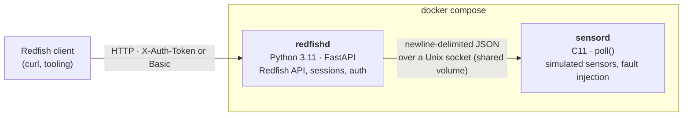

# mini-bmc

[](https://github.com/ccoliu/mini-bmc/actions/workflows/ci.yml)

A small, self-contained simulator of a server **BMC** (Baseboard Management Controller):
a C daemon that simulates sensors and faults, a **DMTF Redfish** REST API on top of it, and
a CI pipeline that checks every response against the official Redfish schemas.
No hardware required: `docker compose up` and talk to it with `curl`.



## Highlights

- **C systems code** – a `poll()`-based Unix-socket daemon with a bounded JSON parser that
  answers malformed input with an error instead of crashing. Unit-tested with Unity, run under
  AddressSanitizer + UBSan, checked with cppcheck and gcov/lcov, built with `-Werror`.
- **Standards conformance** – every Redfish resource and error body is validated against the
  official DMTF JSON schemas (Redfish-Publications 2026.2, pinned by tag and SHA-256). The test
  crawls the API from the service root and hard-codes no URLs, so a dangling link also fails.
- **Fault injection end to end** – overheat a CPU sensor in the C daemon and the Redfish
  chassis reports `HealthRollup: Critical`. Stop the daemon and the API answers `503` with
  `Retry-After`, then recovers on its own when the daemon returns.
- **Security basics done deliberately** – random session tokens that are separate from public
  session IDs, constant-time credential checks, and a test that walks every route and fails if
  any endpoint outside a small allowlist answers without credentials. Containers run as
  non-root on a read-only filesystem with all capabilities dropped, and `sensord` has no
  network at all.
- **CI on every push** – 5 GitHub Actions jobs covering C build and analysis, Python lint
  (ruff), type checks (pyrefly), unit tests, integration tests against both a release and an
  ASan build of the daemon, and a Docker Compose smoke test of the shipped images.

## Quick start

Requires Docker with Compose v2.

```sh
docker compose up --build --wait        # REDFISH_PORT=18000 if port 8000 is taken
scripts/smoke_test.sh                   # 6 end-to-end checks
```

Then explore. The demo credentials are `admin` / `admin`; set `REDFISH_PASSWORD` to change
them. The port is bound to `127.0.0.1` only.

```sh
BASE=http://127.0.0.1:8000/redfish/v1

curl -s $BASE/ | jq                                   # service root: the only public resource
curl -s -o /dev/null -w '%{http_code}\n' $BASE/Chassis/1          # 401 without credentials

# Log in: the token comes back in a header, never in the body
TOKEN=$(curl -s -D - -o /dev/null -X POST $BASE/SessionService/Sessions \
          -H 'Content-Type: application/json' \
          -d '{"UserName": "admin", "Password": "admin"}' |
        awk 'tolower($1) == "x-auth-token:" {print $2}' | tr -d '\r')
AUTH="X-Auth-Token: $TOKEN"

curl -s -H "$AUTH" $BASE/Chassis/1/Sensors/cpu_temp | jq '{Reading, ReadingUnits, Status}'

# Inject a fault into the C daemon and watch it surface through Redfish
scripts/sensordctl.sh '{"cmd": "inject_fault", "sensor": "cpu_temp", "mode": "overtemp"}'
curl -s -H "$AUTH" $BASE/Chassis/1 | jq .Status      # HealthRollup: "Critical"
scripts/sensordctl.sh '{"cmd": "clear_faults"}'

# Power the host off through a Redfish action
curl -s -o /dev/null -w '%{http_code}\n' -H "$AUTH" -X POST \
     -H 'Content-Type: application/json' -d '{"ResetType": "ForceOff"}' \
     $BASE/Systems/1/Actions/ComputerSystem.Reset            # 204
curl -s -H "$AUTH" $BASE/Systems/1 | jq .PowerState         # "Off"
```

`docker compose down -v` stops everything.

## What is implemented

| Resource | Notes |
|---|---|
| `/redfish/v1/` service root | Public. Everything else requires authentication. |
| `Chassis/1`, `Chassis/1/Sensors/{id}` | 3 temperature sensors, 2 fans, 1 PSU. Uses the current `Sensor` model, not the deprecated `Thermal` resource. Health rolls up to the chassis. |
| `Systems/1` + `ComputerSystem.Reset` | Simulated host power. 7 reset types, advertised through `@Redfish.AllowableValues`. |
| `SessionService` | Login (`X-Auth-Token` + `Location`), logout, 30-minute idle timeout. HTTP Basic is accepted too. |
| Errors | Always a Redfish error body using DMTF Base registry messages, for 400, 401, 404, 405, 500 and 503 alike. |

`sensord` simulates `cpu_temp`, `gpu_temp`, `inlet_temp`, `fan1_rpm`, `fan2_rpm` and
`psu_watts`, with four fault modes: `overtemp`, `stuck` (a silent failure), `disconnected` and
`noise`. The socket protocol is specified in [CLAUDE.md](CLAUDE.md#interface).

## Testing strategy

Each layer catches a different class of bug. 170 tests in total, all run in CI.

| Layer | Tool | Count | Catches |
|---|---|---|---|
| sensord unit | Unity (C), under ASan + UBSan | 29 | Parser edge cases, buffer bounds, threshold and fault logic |
| redfishd unit | pytest + a fake sensord | 95 | Error mapping, auth and sessions (with an injectable clock), action validation |
| Integration | pytest against the real daemon, release and ASan builds | 46 | Protocol over a real socket, malformed input, client limits, signals, stale sockets |
| Conformance | DMTF JSON schemas, part of the integration suite | (14) | Wrong property names, invalid enum values, broken links, in healthy, faulted and powered-off states |
| Smoke | `scripts/smoke_test.sh` against `docker compose` | 6 | Problems that only show up in the shipped images and wiring |

The checks are complementary. For example, the DMTF schema accepts any string for
`ReadingUnits`, so only a unit test catches `"C"` where Redfish requires UCUM `"Cel"`.

## Design decisions

- **Unix socket with one JSON object per line** between C and Python: trivially testable with
  any tool, and no network surface. redfishd opens one connection per request, so a daemon
  restart needs no reconnect logic, and every exchange shares a single timeout so a hung daemon
  cannot hang the API.
- **A stale socket is removed only on `ECONNREFUSED`.** Any other connect error proves nothing
  about liveness, so the daemon refuses to start rather than delete another instance's socket.
- **Responses are plain dicts; the official schemas are the oracle.** Redfish keys such as
  `@odata.id` fit models poorly, and validating against DMTF's own schemas is a stronger check
  than validating against models written for this project. The 25 schema files the tests
  need are vendored. The full closure through `$ref` would be 1,324 files.
- **Authentication is a FastAPI dependency, not path-matching middleware.** Routing decides what
  is protected, and a route-walk test catches any new endpoint that forgets the dependency. It
  is `async` on purpose: plain `def` dependencies run in a thread pool, and the session store is
  not thread-safe.
- **An unreadable sensor makes the chassis `Warning`.** Losing monitoring is itself a problem,
  so it is never reported as `OK`.

## Known limitations

These are deliberate simplifications for a simulator, not oversights. There is no TLS (plain
HTTP, loopback only in Compose), a single account comes from environment variables, and there
is no lockout or rate limiting on login. Sessions live in memory and do not survive a restart.

## Roadmap

- [x] `sensord`: C daemon, fault injection, sanitizers, coverage, static analysis
- [x] `redfishd` MVP: Redfish resources, sessions, schema conformance, Docker Compose, CI
- [ ] Firmware update via `UpdateService`: checksum verification, rejecting corrupt images,
      automatic rollback
- [ ] Serve `$metadata` and run the DMTF Redfish Service Validator in CI

## Development

Linux or WSL2. One virtualenv covers every Python tool.

```sh
make -C sensord && make -C sensord test && make -C sensord sanitize
python3 -m venv .venv && .venv/bin/pip install -e "./redfishd[dev]"
(cd redfishd && ../.venv/bin/pytest)            # redfishd unit tests
.venv/bin/pytest                                # integration + conformance
.venv/bin/ruff check . && .venv/bin/pyrefly check
```

Layout: `sensord/` (C daemon), `redfishd/` (FastAPI app), `tests/` (integration and
conformance, plus the vendored schemas), and `scripts/`. [CLAUDE.md](CLAUDE.md) holds the
detailed specification and conventions.

## License

MIT. `sensord/third_party/unity` is [Unity](https://github.com/ThrowTheSwitch/Unity) (MIT).
The files in `tests/redfish_schemas/` are published by [DMTF](https://www.dmtf.org) and carry
DMTF's copyright notice. This project is not affiliated with DMTF.
